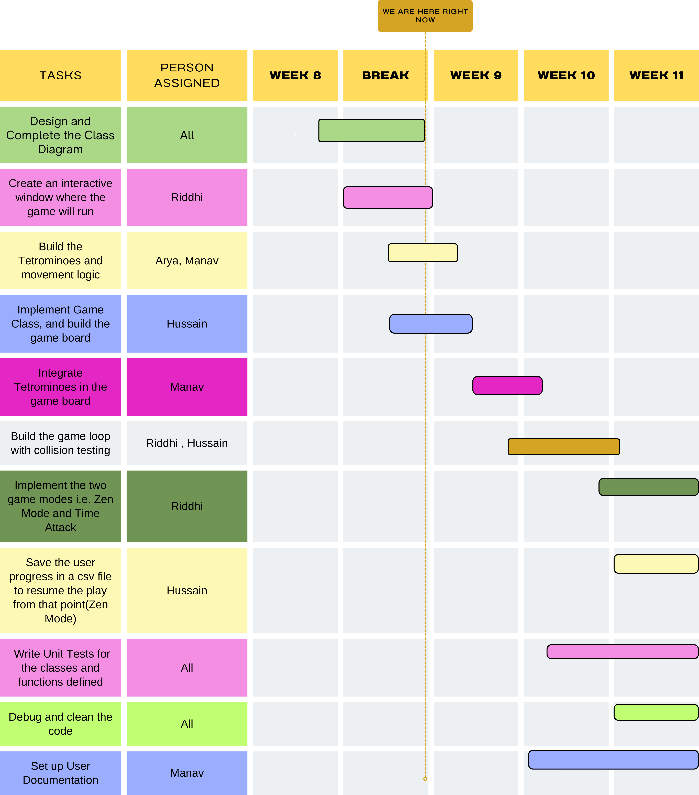

# Project Title : Tetris (Group 44) (Project Plan)

## **Use Case Description**

Tetris is a captivating puzzle video game that immerses players in a world of strategic thinking and rapid decision-making. This project is designed for gamers of all ages and skill levels. The core gameplay revolves around the manipulation of Tetrominoes, geometric shapes consisting of four blocks each. The central goal of the game is for players to skilfully arrange and rotate these descending, Tetrominoes preventing them from stacking up to the top of the screen for as long as possible. 

In Tetris, the purpose is to bring down these blocks from the top of the screen and strategically position them to create complete horizontal lines within a 20x10 rectangular matrix. This achievement entails players earning points for breaking each line. Advancing levels increases the points granted for each completed line. The more horizontal lines you clear, the longer your playing session and the higher your score. Additionally, as the game progresses, the pace of falling Tetrominoes quickens, demanding faster reflexes and sharpened wit. 

## **Class Diagram**

## **Project Task List and Timeline**

- [ ] Design and Complete the Class Diagram
- [ ] Create an interactive window where the game will run
- [ ] Implement Game Class, and build the game board
- [ ] Build the Tetrimonoes and movement logic
- [ ] Integrate them in the game board
- [ ] Build the game loop with collision testing
- [ ] Implement the two game modes i.e. Zen Mode and Time Attack
- [ ] Save the user progress in a csv file to resume the play from that point(Zen Mode)
- [ ] Write Unit Tests for the classes and functions defined
- [ ] Debug and clean the code
- [ ] Set up User Documentation

## **User Interaction Description**

To begin with your Tetris Adventure, user will initiate the game by pressing the enter key. The game begins with a blank 20X10 rectangular Matrix at the top of the screen. 

The user interface is designed to provide a seamless interaction for players of all skills levels. The user will navigate the game using the left and right arrow keys to move the Tetrominoes horizontally within the matrix. For rotations we use the up arrow key and we use spacebar for the force push of the tetromino block . When the user desires to increase the speed of falling tetromino, simply tap the down arrow key. 

During unintended moves, for example, moving the falling tetromino outside the boundary of the 20X10 matrix, the program doesn't allow the player to do so and responds with no action. 

As the user progresses, the earned points will be readily visible, allowing them to track their performance over time. If the user decides to conclude with a Tetris session, the Esc key provides a swift exit from the game.

## **Unit Testing and Debugging Plan**

Having a testing and debugging plan is essential to ensure the reliability and correctness of the codebase. Therefore, the code will be broken down into **smaller testable parts** i.e the Tetrominoes, game board etc. and unit tests will be performed to cover various scenarios and edge cases. 

Since we'll be using CMake to build the project, we've chosen to use ***ctest*** as a part of CMake to streamline the testing process. 

A log of test results will be maintained to monitor the progress and identify any test failures or errors. 

In terms of debugging, we'll be using CLion by Jetbrains to assist in the debugging process.

Well documented **README** file is also included in our project that acts as a user guide on how to play the game and also provides instructions on how to compile and start the game. It will also outline any issue if detected. 

On the technical side, CMake is used for the project's build process, simplifying compiler settings, dependency management, and target definitions. **CMakeLists.txt** files in dedicated directories maintain project modularity, aiding in organization and scalability. 